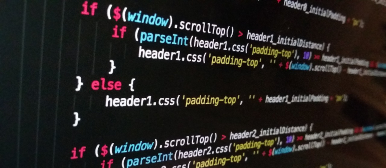

## Introduction

As a student who just transferred to the University of Hawaii at Manoa, I wasn’t sure what was waiting for me beyond the doors to Professor Cam Moore’s ICS 314 – Software Engineering section. What I quickly found out was that it was a lot like diving into a cold pool early in the morning – it was one hell of a wake-up call. In the first weeks of class we were given several assignments to assist us in setting up our own Professional Personas, such as setting up a LinkedIn account, and registering for the tech networking website TechHui. Along the way the class was also given a hefty helping of JavaScript 101 from freecodecamp.com, which was meant to prepare us for our first WOD, or ‘Work Out of the Day’. For those who may not be familiar with WOD’s, these are short programming exercises that that are one of the main components of a weekly regiment known as Athletic Software Engineering, or ASE for short. WOD’s are a lot like a short duration, high intensity workout, requiring students to utilize one or more skills to complete a task within a set amount of time. To say that this was intimidating would be a gross understatement, I was shaking in my boots and we had only finished going over the class syllabus. However, with the first week’s prep work in the books and the first WOD looming over us, that’s when it hit me. This class means business, this program means business, and it’s time to sink or swim.

## JavaScript

Having completed the 106 exercises in basic JavaScript the first thing I felt was a resounding sense of relief. Not because I was glad that it was over, but because coding in JavaScript felt a lot like running into an old friend that you haven’t seen in a while, and that friend is Java. Some things are different here and there, but mostly the same except for that JavaScript is, for better or worse, a dynamically typed language. What this essentially means is that there is no variable typing like there is in Java, think int, double, or float. Instead, we have var, along with let and const as of ES6, which encompass all data types. Take a look at the following snippet of code as an example: 

```javascript
let foo = 0;
console.log(foo); //outputs 0
foo = ‘Zero’;
console.log(foo); //outputs Zero
```

Here we have a single variable ‘foo’ which is instantiated as an integer whose value is then displayed in the console. Next, foo is assigned a string value of ‘Zero’ and again displayed in the console. In Java this code would send your compiler into a fit of type errors. However, since JavaScript is dynamically typed, our variable foo is able to take on a variety of different types. In my opinion, this gives developers a bit more flexibility to implement a number of elegant solutions that would normally require a bit more work using Java. Although I will concede that this also has the potential to make hunting down bugs a nightmarish experience. 
Another significant difference between Java and JavaScript was the change from immutable objects, to mutable objects. Essentially, this means that JavaScript allows us to continue to add fields to an object even after its been created. Once again, I feel that this gives developers more flexibility with their code, so while Java may be considered the more powerful language between the two, I have found the flexibility that JavaScript offers to be a refreshing change of pace.

## Athletic Software Engineering

Athletic Software Engineering, what exactly does that mean? No, it is not an exercise program for software engineers. At least, not in the traditional sense. ASE is a weekly ‘workout’ regiment that is designed to encourage students to have a deeper understanding of the course material, and work more efficiently. After going over the material for the current module, students complete several practice WOD’s at home, a group WOD in class, and then ending the week with the solo in class WOD. I found this method of learning to be both effective and enjoyable. The solo in class WOD, while being stressful, is a lot of fun and feels a lot like a race, which serves as great motivation if you’re the competitive type like myself. However, my personal favorite is without a doubt, the group WOD. This WOD focuses heavily on teamwork and communication as partners must work together, coding in tandem with one another to complete the given problem at the same time, within the allotted time. This opportunity to actively discuss ideas, and work with peers to achieve a goal was an invaluable, and truly enjoyable experience to have. 

## Final Thoughts

WOD’s, JavaScript, Athletic Software Engineering, its enough to make your head spin. We tackled a lot in these first two weeks, and as the sun sets on my second week of ICS 314 it’s still hard to say what other experiences are waiting for me through the doors of Professor Cam Moore’s classroom. But I can say this much, I’ll be looking forward to it, and welcoming them all with open arms.
