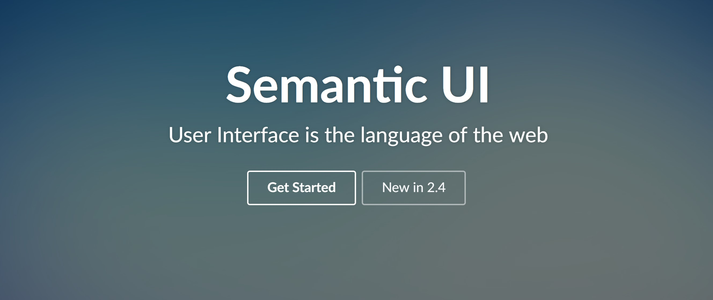

## Intro
In this week’s UI Design (Framework) module in ICS 314 we made the jump from raw HTML and CSS to using UI Frameworks for web development. Our goal for this week was to become comfortable using a UI Framework to design usable, responsive, and attractive web pages. The framework that we used is the open source CSS framework Semantic-UI which gave us access to a wealth of features, all of which have excellent documentation.

## What Are UI Frameworks?
UI Frameworks are a library that provides tools that help to build a web application. The main benefit of a UI Framework is that they take care of the boilerplate code for you. This allows developers to quickly create a usable, responsive, and attractive web page, rather than having to create all of its components from scratch. Some popular UI Frameworks are Bootstrap, Foundation, Materialize, and Material UI.

## Why You Should Definately be Using a Framework
UI frameworks are difficult to learn and can be downright frustrating at times, but you should definately be using one. If you were to think of the development process as a race, using a framework is the equivalent of moving your starting line closer to the goal. Working with only raw HTML and CSS is a tedious and time-consuming process. While a developer who is not using a framework is using development time to create the many components that make up a webpage, a developer who does elect to use a framework will instead be able to use that time to focus on higher order problems like the look and feel of the web application. Because UI Frameworks handle the boilerplate code for you, that time can be spent tweaking the framework’s pre-made components to your liking. As a result, you get a more attractive product, with less time invested. It’s also important to note that many UI Frameworks are highly customizable. This allows more experience developers to fine tune to their hearts content, while also helping to prevent “cookie cutter” webpages. 

## My Experience With Semantic-UI
Using Semantic-UI was an absolute joy. My favorite part of semantic UI (and UI Frameworks in general) is getting to see results of your work almost immediately. Once we started using Semantic-UI for development, websites that we made suddenly had a modern look and feel. A stark contrast to our previous webpages, that looked and felt like they were made in the 1990’s. However, there were also a fair share of frustration. Semantic-UI is highly customizable, but the boilerplate code for Semantic-UI’s classes have high priority. In order to overwrite default values it was necessary to either assign an id to every component that I wanted to change, or create a class and mark all of my changes with !important. This is of course a trivial issue, but I felt that it was worth mentioning because it did take me a while to figure out. 

## Final Thoughts
Working with Semantic-UI was a very positive experience, and although there were a few minor annoyances here and there, it is absolutely a tool that is worth learning and I would recommend it to any developer that is getting started in web development. Next week in ICS 314 we will be starting our module on React, a component-based framework that will bring us one step closer to achieving competency in our class software stack.
