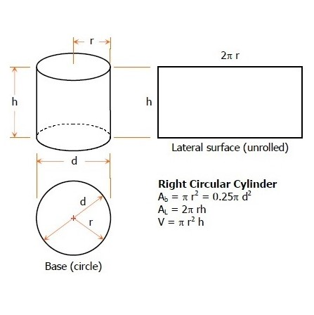

## Description

As an assignment for ICS 212 - Program Structure I was tasked with using C++ to create two classes, One parent class representing a circle, and a child class that represents a cylinder. The key skills we utilized in this assignment were inheritance, method overriding, and constructor overloading. This allowed us to see the interaction between parent and child classes and how it might be implemented in a real-life situation.

## Lesons Learned

Prior to this assignment I had some difficulty discerning the advantages of using inheritance. However, after getting the opportunity to put this skill to use, I have since realized that it can be used in many more situations than I previously thought. It’s sometimes easy to get caught up in the for-loops and if-statements instead of taking a step back and looking at the bigger picture at the class level, and this assignment helped me to do that.

## Skills Acquired

This assignment gave me practice with inheritance, method overriding, and constructor overloading in C++.

You can find the source code for all my projects in my project's repository on [github](https://github.com/conradwolfe/icsprojects/blob/master/ics_212_23/WolfeConrad23.cpp).
